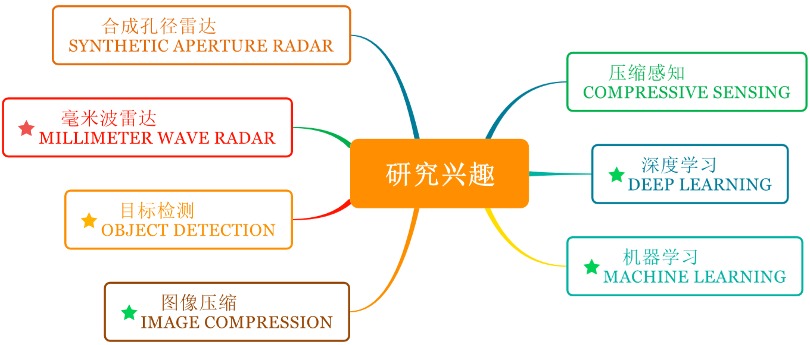

# Interests

压缩感知(Compressive Sensing)、 深度学习(Deep Learning)、 机器学习(Machine Learning), 目标检测(Object Detection) 图像压缩(Image Compression), 毫米波雷达(Millimeter Wave Radar)、合成孔径雷达成像(Synthetic Aperture Radar Imaging)、嵌入式软硬件(Embedded Software and Hardware).

