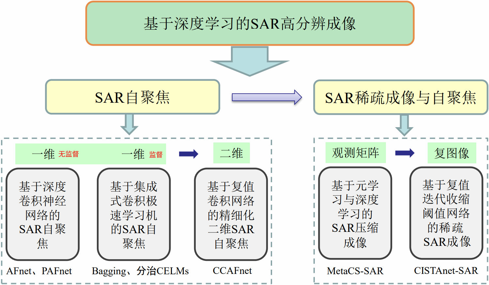

# Publications

## Paper

- **Liu, Z.**, Yang, S., Gao, Q., Feng, Z., Wang, M., Jiao L. . (2022). AFnet and PAFnet: Fast and Accurate SAR Autofocus Based on Deep Learning. IEEE Transactions on Geoscience and Remote Sensing, 60, 1-13. [pdf](https://ieeexplore.ieee.org/document/9931653), [doi](https://doi.org/10.1109/TGRS.2022.3217063), [code](https://github.com/aisari/AutofocusSAR), [bib](./bib/TGRS2022PAFnet.bib)

- **Liu, Z.**, Yang, S., Feng, Z., Wang, M., Yu, Z. . (2023). Deep Compressive Imaging With Meta-Learning. IEEE Transactions on Instrumentation and Measurement, 72, 1-9. [pdf](https://ieeexplore.ieee.org/document/9991048), [doi](https://doi.org/10.1109/TIM.2022.3228011), [code](https://github.com/aisari/SparseSAR), [bib](./bib/TIM2023MetaCSSAR.bib)

- **Liu, Z.**, Yang, S., Feng, Z., Gao, Q., Wang, M. . (2021).  Fast SAR Autofocus Based on Ensemble Convolutional Extreme Learning Machine. Remote Sensing, 13, 2683. [pdf](https://www.mdpi.com/2072-4292/13/14/2683/pdf), [doi](https://doi.org/10.3390/rs13142683), [code](https://github.com/aisari/AutofocusSAR), [ga](./Details/AutofocusSAR/GraphicalAbstractBaggingECELMs.png), [bib](./bib/RS2021BaggingECELMs.bib)

- Yang, S. , **Liu, Z.** , Gao, Q. Feng, Z. . (2019). Extreme Self-Paced Learning Machine for On-Orbit SAR Images Change Detection. IEEE Access, 7, 116413-116423. [pdf](https://ieeexplore.ieee.org/document/8796343), [doi](https://doi.org/10.1109/ACCESS.2019.2934983)

- Wang, M. , Yang, S. , **Liu, Z.** , & Li, Z. . (2019). Collaborative compressive radar imaging with saliency priors. IEEE Transactions on Geoscience and Remote Sensing, PP(99), 1-11. [pdf](https://ieeexplore.ieee.org/document/8614440), [doi](https://doi.org/10.1109/TGRS.2018.2856923)

- Yang, S. , Wang, M. , Feng, Z. , **Liu, Z.** , & Li, R. . (2018). Deep sparse tensor filtering network for synthetic aperture radar images classification. IEEE Transactions on Neural Networks and Learning Systems, 1-6. [pdf](https://ieeexplore.ieee.org/document/8307437), [doi](https://doi.org/10.1109/TNNLS.2017.2688466)

- Feng, Z. , Wang, M. , Yang, S. , **Liu, Z.** , Liu, L. , & Wu, B. , et al. (2017). Superpixel tensor sparse coding for structural hyperspectral image classification. IEEE Journal of Selected Topics in Applied Earth Observations and Remote Sensing, 10(4), 1632-1639. [pdf](https://ieeexplore.ieee.org/document/7819531), [doi](https://doi.org/10.1109/JSTARS.2016.2640449)

- Yang, L. , Yang, S. , Li, S. , **Liu, Z.** , & Jiao, L. . (2017). Incremental laplacian regularization extreme learning machine for online learning. Applied Soft Computing, 59. [pdf](https://www.sciencedirect.com/science/article/pii/S1568494617303290), [doi](https://doi.org/10.1016/j.asoc.2017.05.051)

- Yang, S. , Wang, M. , Long, H. , & **Liu, Z.** . (2016). Sparse robust filters for scene classification of synthetic aperture radar (sar) images. Neurocomputing, 184, 91-98. [pdf](https://www.sciencedirect.com/science/article/pii/S0925231215017646?via%3Dihub), [doi](https://doi.org/10.1016/j.neucom.2015.08.103)

- **刘志**. (2012). 指数函数和对数函数的图像交点个数. 高等数学研究,15(5), 43-45. [pdf](http://www.wanfangdata.com.cn/details/detail.do?_type=perio&id=gdsxyj201205024), [blog](https://blog.csdn.net/enjoyyl/article/details/11602431)

## Patent

- 杨淑媛,**刘志**,王敏,龙贺兆,刘红英,侯彪,熊涛,缑水平,刘芳,焦李成. 基于深度自编码网络的大压缩比卫星遥感图像压缩方法[P]. 陕西：CN105163121A,2015-12-16. [pdf](https://kns.cnki.net/kcms/detail/detail.aspx?dbcode=SCPD&dbname=SCPD2016&filename=CN105163121A&v=cT5nwmPEhp09qiUlLqpY6ztZD0W8z4mKOQfd4hLgdZS5zJA0f45qhHR9uxy6WCsY)

## Dissertation

| [sar](https://sar.iridescent.ink/) | [torchsar](https://aisari.iridescent.ink/torchsar/) | [AutofocusSAR](https://github.com/aisari/AutofocusSAR) | [SparseSAR](https://github.com/aisari/SparseSAR) |

## Details

- [Learned Compressive Imaging](./Details/LCI.md)

